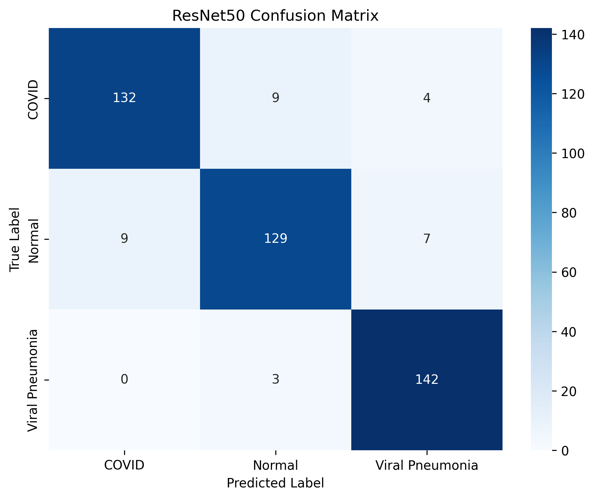

# Explainable_CV

# Results for ResNet50 ( Frozen )

| Metric    | Value  |
| --------- | ------ |
| Accuracy  | 92.64% |
| Precision | 92.64% |
| Recall    | 92.64% |
| F1 Score  | 92.61% |

## Confusion Matrix



# Grad-CAM Explainability Analysis

## A. Correct COVID Predictions

| Sample         | Observation                                                                                                                                               |
| -------------- | --------------------------------------------------------------------------------------------------------------------------------------------------------- |
| COVID Sample 1 | Grad-CAM strongly activates bilateral lower lung regions, indicating that the model is focusing on pulmonary infiltrates associated with COVID infection. |
| COVID Sample 2 | Concentrated activations are visible around patchy opacities in the right lung, suggesting meaningful pathological localization.                          |
| COVID Sample 3 | Heatmap highlights diffuse mid-lung abnormalities with minimal background activation, showing anatomically relevant attention.                            |
| COVID Sample 4 | Model attention is localized around peripheral lung regions, consistent with common COVID radiographic manifestations.                                    |
| COVID Sample 5 | Strong bilateral activation indicates the model successfully captured abnormal pulmonary textures instead of irrelevant structures.                       |

---

## B. Correct Normal Predictions

| Sample          | Observation                                                                                                              |
| --------------- | ------------------------------------------------------------------------------------------------------------------------ |
| Normal Sample 1 | Activations are weak and diffuse with no concentrated pathological hotspots, indicating healthy lung interpretation.     |
| Normal Sample 2 | Heatmap distribution is scattered uniformly across the chest without strong abnormal focus regions.                      |
| Normal Sample 3 | Minimal activation inside lung fields suggests absence of disease-related features.                                      |
| Normal Sample 4 | Model attention remains low-intensity and broadly distributed, which aligns with normal chest anatomy.                   |
| Normal Sample 5 | No major localized saliency regions are observed, indicating the model correctly identifies non-pathological structures. |

---

## C. Correct Viral Pneumonia Predictions

| Sample                   | Observation                                                                                                             |
| ------------------------ | ----------------------------------------------------------------------------------------------------------------------- |
| Viral Pneumonia Sample 1 | Grad-CAM highlights widespread inflammatory regions across both lungs, consistent with viral pneumonia characteristics. |
| Viral Pneumonia Sample 2 | Strong activations are observed in dense pulmonary opacity regions, demonstrating pathology-focused attention.          |
| Viral Pneumonia Sample 3 | Heatmap covers extensive lower lung areas, suggesting recognition of diffuse infection patterns.                        |
| Viral Pneumonia Sample 4 | Model attention is concentrated around asymmetric infiltrates visible in the lung fields.                               |
| Viral Pneumonia Sample 5 | Broad activation patterns indicate the model successfully captured pneumonia-associated radiographic abnormalities.     |

---

# D. Misclassified Samples

| Actual          | Predicted       | Observation                                                                                                                     |
| --------------- | --------------- | ------------------------------------------------------------------------------------------------------------------------------- |
| COVID           | Viral Pneumonia | Overlapping pulmonary opacities between COVID and viral pneumonia likely caused confusion due to similar radiographic patterns. |
| COVID           | Normal          | Infection regions appear subtle with weak contrast, causing the model to miss disease-specific features.                        |
| COVID           | Viral Pneumonia | Diffuse bilateral infiltrates resemble generalized viral pneumonia characteristics, leading to misclassification.               |
| Normal          | COVID           | Noise and localized high activations may have falsely resembled pathological opacities.                                         |
| Normal          | Viral Pneumonia | Minor imaging artifacts and texture irregularities possibly triggered abnormal feature detection.                               |
| Viral Pneumonia | COVID           | Significant overlap exists between viral pneumonia inflammation and COVID infection patterns in chest X-rays.                   |
| COVID           | Normal          | Grad-CAM shows weak pathological localization, indicating low-confidence feature extraction.                                    |
| Normal          | COVID           | Bright regions outside primary lung structures may have influenced incorrect activation behavior.                               |
| Viral Pneumonia | Normal          | Mild pneumonia manifestations may not have produced sufficiently strong discriminative features.                                |
| COVID           | Viral Pneumonia | Attention maps focus on similar bilateral lung regions common to both respiratory diseases.                                     |

---

# Overall Explainability Discussion

The Grad-CAM analysis demonstrated that the ResNet50 model generally focused on clinically relevant lung regions while making predictions. Correctly classified COVID and Viral Pneumonia samples showed concentrated activations around pulmonary infiltrates and opacity regions, whereas Normal samples exhibited weaker and more diffuse attention maps. Misclassified samples revealed significant overlap between COVID and Viral Pneumonia radiographic characteristics, highlighting the inherent difficulty of distinguishing respiratory infections using chest X-rays alone.

Several failure cases exhibited weak or dispersed activations, indicating that subtle pathological manifestations, low image contrast, and imaging artifacts contributed to incorrect predictions. Importantly, the Grad-CAM visualizations confirmed that the model primarily attended to anatomically meaningful lung structures instead of irrelevant background regions, supporting the reliability and interpretability of the classification pipeline.

---

# Vision Transformer (ViT-B/16)

## Motivation

To extend the explainability analysis beyond CNN-based localization methods, a Vision Transformer (ViT-B/16) architecture was implemented for comparative transformer-based interpretability analysis.

The primary objective was not only classification performance but also understanding how transformer attention mechanisms behave on medical imaging data.

---

# ViT-B/16 Training Strategy

Initially, full fine-tuning of the ViT-B/16 backbone was attempted. However, training proved computationally expensive on laptop GPU hardware.

Observed:

- Approximately 1 hour for only 2 epochs
- High GPU memory consumption
- Slow convergence

To improve computational efficiency while preserving explainability capability, the transformer backbone was frozen and only the classification head was trained.

```python
for param in model.parameters():
    param.requires_grad = False

for param in model.heads.parameters():
    param.requires_grad = True
```

---

# Why Freeze the Backbone?

The frozen-backbone strategy was selected because the project primarily focuses on explainability analysis rather than maximizing benchmark accuracy.

Advantages of this approach:

- Reduced training time
- Lower GPU memory consumption
- Improved training stability
- Reduced overfitting risk
- Faster experimentation for explainability analysis
- Preservation of pretrained ImageNet representations

---

# ViT-B/16 Configuration

| Parameter         | Value   |
| ----------------- | ------- |
| Image Size        | 224×224 |
| Optimizer         | Adam    |
| Learning Rate     | 1e-3    |
| Epochs            | 10      |
| Backbone          | Frozen  |
| Transfer Learning | Yes     |

---

# ViT-B/16 Results

## Classification Report

| Class           | Precision | Recall | F1-Score |
| --------------- | --------- | ------ | -------- |
| COVID           | 0.98      | 0.83   | 0.90     |
| Normal          | 0.85      | 0.96   | 0.90     |
| Viral Pneumonia | 0.98      | 0.99   | 0.99     |

---

## Overall Metrics

| Metric          | Score |
| --------------- | ----- |
| Accuracy        | 93%   |
| Macro Avg F1    | 0.93  |
| Weighted Avg F1 | 0.93  |

---

# ViT Learning Curves

## Loss Curve


---

## Accuracy Curve


---

# ViT Confusion Matrix


---

# Comparative Insights

## ResNet50 + Grad-CAM

Strengths:

- Strong spatial localization
- Clear pulmonary attention regions
- Computationally efficient

Limitations:

- Limited global contextual understanding
- Sensitive to overlapping respiratory patterns

---

## ViT-B/16 + Attention Rollout

Strengths:

- Global attention modeling
- Better contextual feature understanding
- Transformer interpretability analysis

Limitations:

- Computationally expensive
- Slower convergence
- Requires larger datasets for optimal performance

---

# Explainable AI Perspective

The project evolved from a standard medical image classification pipeline into a research-oriented Explainable AI framework focused on understanding:

- Model decision behavior
- Failure cases
- Attention mechanisms
- CNN vs Transformer interpretability

Rather than only maximizing classification accuracy, the project emphasizes understanding _why_ predictions are made.

---

# Saved Outputs

```text
outputs/
│
├── gradcam/
│
├── vit/
│   ├── best_vit_model.pth
│   ├── final_vit_model.pth
│   ├── vit_loss_curve.png
│   ├── vit_accuracy_curve.png
│   ├── vit_confusion_matrix.png
│   ├── vit_metrics.json
│   ├── vit_classification_report.txt
│   ├── vit_predictions.csv
│   ├── misclassified/
│   └── attention_rollout/
```

---

# Repository Structure

```text
project/
│
├── notebooks/
│   ├── EDA.ipynb
│   ├── preprocessing.ipynb
│   ├── resnet50_training.ipynb
│   ├── gradcam_analysis.ipynb
│   ├── vit_training.ipynb
│   ├── attention_rollout.ipynb
│   └── evaluation.ipynb
│
├── outputs/
│
├── README.md
│
└── requirements.txt
```

---

# Future Work

Planned improvements:

- Attention Rollout implementation
- Quantitative explainability evaluation
- Clinical relevance validation
- Transformer attention comparison
- Multi-label pathology classification
- Research paper preparation

---

# Key Research Contribution

The major contribution of this work is the comparative explainability analysis between:

- CNN-based Grad-CAM visualizations
  and
- Transformer-based Attention Rollout methods

for chest X-ray classification.

The project demonstrates how Explainable AI techniques can help interpret deep learning behavior in medical imaging systems.
