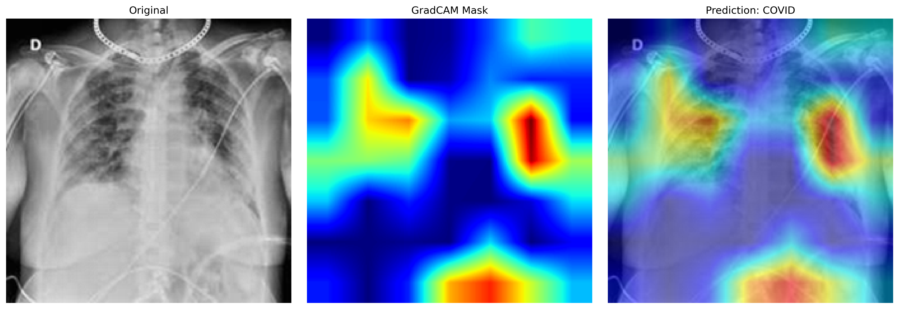
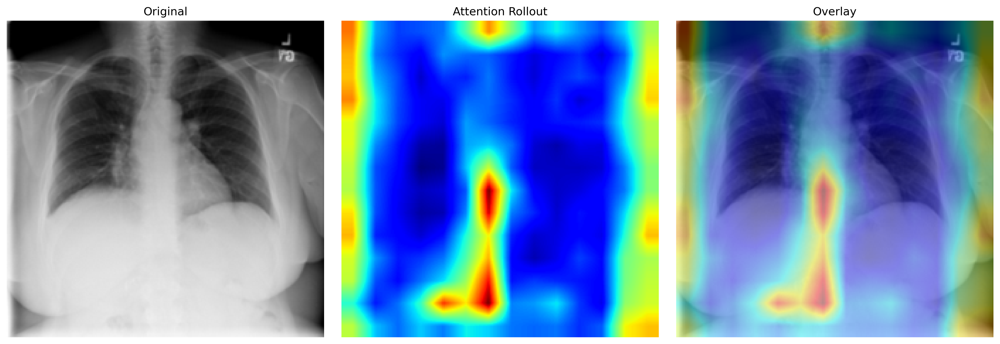
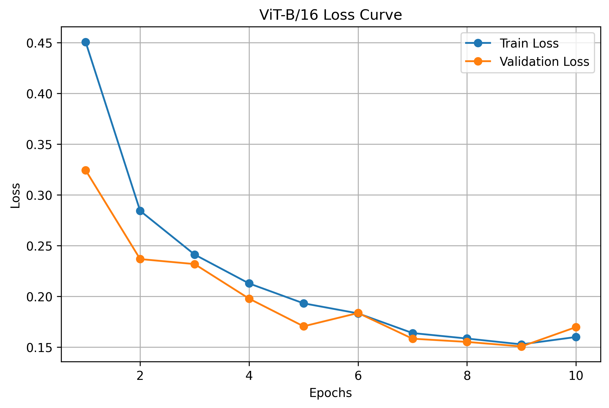
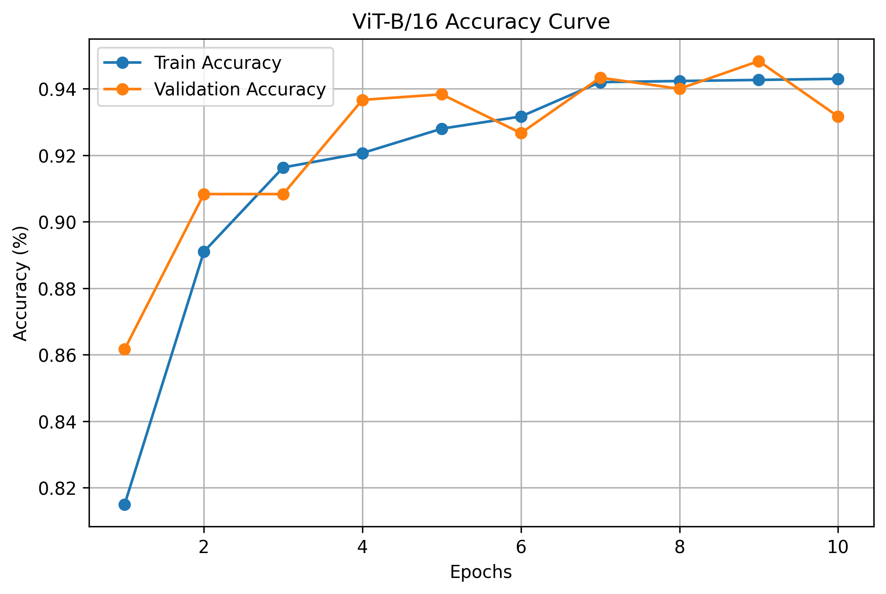
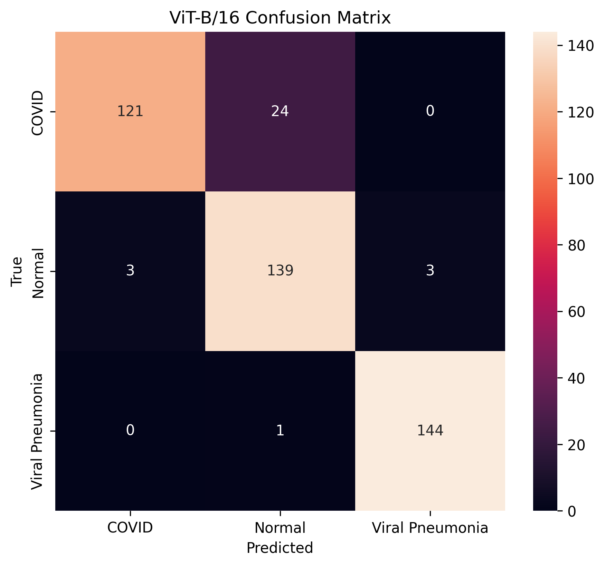
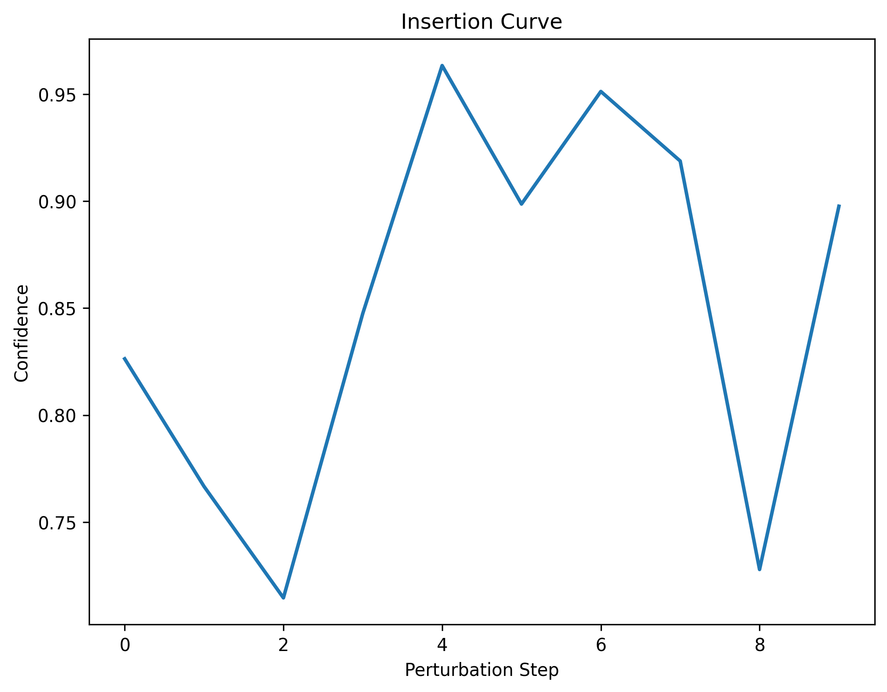
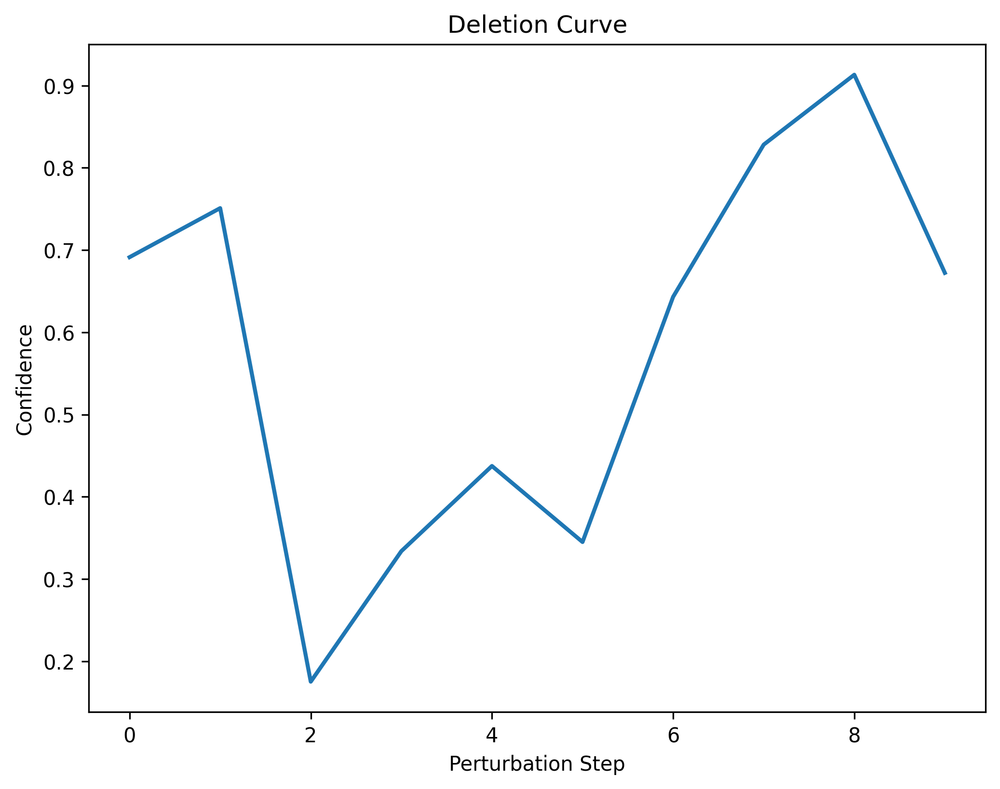
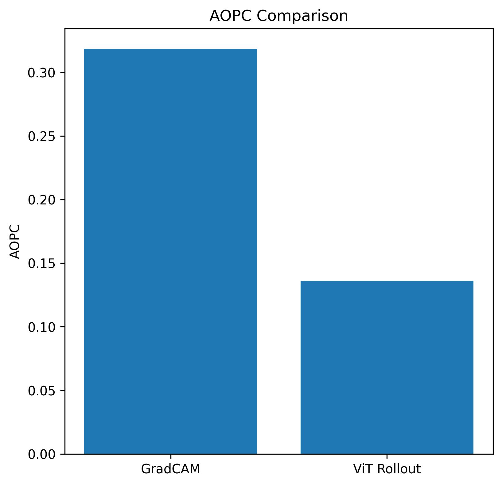

# Explainable Computer Vision for Chest X-Ray Classification

A comparative Explainable AI (XAI) framework for chest X-ray classification using:

- ResNet50 + Grad-CAM
- Vision Transformer (ViT-B/16) + Attention Rollout

developed as part of the **AIMS DTU Research Internship 2026 — Explainable Computer Vision Track**.

---

# Project Overview

This project focuses on building interpretable deep learning models for medical image analysis using chest X-ray classification.

Unlike conventional medical imaging projects that prioritize only classification accuracy, this work emphasizes:

- model transparency
- saliency map analysis
- explainability evaluation
- CNN vs Transformer interpretability comparison
- quantitative XAI benchmarking

The project investigates how different architectures reason while classifying:

- COVID
- Normal
- Viral Pneumonia

from chest X-ray images.

---

# Research Motivation

Explainable Computer Vision aims to make deep learning models transparent and interpretable, especially in high-stakes domains such as healthcare where incorrect predictions may lead to serious consequences.

Medical imaging systems must not only produce predictions, but also explain:

- why a disease was predicted
- which image regions influenced the prediction
- whether the model focuses on clinically meaningful structures

This project was developed to explore these explainability challenges through comparative saliency analysis between CNNs and Vision Transformers.

---

# Dataset

Chest X-ray dataset containing:

- COVID
- Normal
- Viral Pneumonia

classes.

---

# Preprocessing Pipeline

- Images resized to **224×224**
- CLAHE enhancement applied
- Mild augmentation strategy
- Mean/std normalization
- Anatomically safe augmentations only

## Normalization

```python
mean = (0.5159, 0.5159, 0.5159)
std  = (0.2280, 0.2280, 0.2280)
```

## Important Design Choice

Aggressive augmentations such as:

- vertical flips
- large rotations
- excessive color jitter

were intentionally avoided because they can distort anatomical structures in medical images.

---

# Models Used

# 1. ResNet50 (CNN)

Transfer learning based CNN architecture using pretrained ResNet50.

## Training Strategy

- Pretrained ImageNet weights
- Backbone frozen initially
- Fully connected layer fine-tuned

## Configuration

| Parameter         | Value   |
| ----------------- | ------- |
| Optimizer         | Adam    |
| Learning Rate     | 1e-3    |
| Image Size        | 224×224 |
| Epochs            | 10      |
| Transfer Learning | Yes     |

---

# 2. Vision Transformer (ViT-B/16)

Transformer-based architecture implemented for comparative explainability analysis.

## Motivation

The objective of using ViTs was to study:

- transformer attention behavior
- distributed contextual reasoning
- transformer interpretability mechanisms

in medical imaging systems.

---

# ViT-B/16 Training Strategy

Initially, full fine-tuning was attempted but proved computationally expensive on laptop GPU hardware.

Observed:

- Slow convergence
- High GPU memory consumption
- Approximately 1 hour for only 2 epochs

To improve efficiency, the backbone was frozen and only the classification head was trained.

```python
for param in model.parameters():
    param.requires_grad = False

for param in model.heads.parameters():
    param.requires_grad = True
```

## Advantages

- Faster convergence
- Reduced overfitting
- Lower computational cost
- Stable explainability experimentation
- Preservation of pretrained representations

---

# Explainability Methods

# Grad-CAM (CNN Explainability)

Grad-CAM was applied on ResNet50 to visualize discriminative image regions responsible for predictions.

The generated saliency maps demonstrated:

- localized pulmonary attention
- concentrated pathology-focused activations
- clinically meaningful region localization

---

# Example Grad-CAM Visualization



---

# Attention Rollout (Transformer Explainability)

Attention Rollout was implemented for ViT-B/16 interpretability analysis.

## Important Technical Challenge

Torchvision ViT models do not expose attention weights directly in a usable format.

To solve this, a custom attention module was implemented using:

```python
CustomMultiheadAttention
```

with:

```python
need_weights=True
average_attn_weights=False
```

This allowed extraction of transformer attention maps for rollout computation.

---

# Example Attention Rollout Visualization



---

# Explainability Evaluation Metrics

The project evaluates saliency quality using multiple quantitative explainability metrics.

## Metrics Used

### 1. Entropy

Measures saliency concentration vs diffusion.

### 2. Insertion / Deletion Evaluation

Measures prediction confidence changes when salient regions are inserted or removed.

### 3. AOPC (Area Over Perturbation Curve)

Measures confidence degradation after perturbing highly salient regions.

---

# Key Research Findings

## CNN vs Transformer Explainability

| CNN (Grad-CAM)                   | ViT (Attention Rollout)        |
| -------------------------------- | ------------------------------ |
| Localized reasoning              | Distributed reasoning          |
| Focused saliency                 | Diffuse saliency               |
| Strong perturbation sensitivity  | Smoother perturbation behavior |
| Spatially concentrated attention | Contextual global attention    |

---

# Quantitative Results

| Metric         | Grad-CAM | Attention Rollout |
| -------------- | -------- | ----------------- |
| Entropy        | Lower    | Higher            |
| Deletion Drop  | Sharper  | Smoother          |
| Insertion Rise | Sharper  | Smoother          |
| AOPC           | Higher   | Lower             |

---

# ResNet50 Results

| Metric    | Score  |
| --------- | ------ |
| Accuracy  | 92.64% |
| Precision | 92.64% |
| Recall    | 92.64% |
| F1 Score  | 92.61% |

---

# ResNet50 Confusion Matrix


---

# ViT-B/16 Results

| Metric      | Score |
| ----------- | ----- |
| Accuracy    | ~93%  |
| Macro F1    | 0.93  |
| Weighted F1 | 0.93  |

---

# ViT Learning Curves

## Loss Curve



---

## Accuracy Curve



---

# ViT Confusion Matrix



---

# Insertion Evaluation

Insertion evaluation measures how rapidly prediction confidence increases when the most salient image regions are gradually inserted into the input image.

A steeper confidence increase indicates that the saliency map correctly identifies highly informative regions.

---

# Insertion Curve



---

# Deletion Evaluation

Deletion evaluation measures how rapidly prediction confidence decreases when the most salient regions are progressively removed from the image.

A sharper confidence drop indicates stronger dependence on highlighted salient regions.

---

# Deletion Curve



---

# AOPC Evaluation

AOPC (Area Over the Perturbation Curve) quantitatively measures confidence degradation caused by perturbing salient regions.

Higher AOPC values indicate stronger and more meaningful saliency localization.

---

# AOPC Comparison



---

# Explainability Observations

## Grad-CAM

Correctly classified COVID and Viral Pneumonia samples showed:

- concentrated pulmonary activations
- pathology-focused localization
- limited background attention

Normal samples showed:

- weak diffuse activations
- absence of pathological focus regions

---

## Attention Rollout

Attention Rollout produced:

- globally distributed attention maps
- smoother saliency transitions
- context-aware activation behavior

Unlike Grad-CAM, transformer explanations were more diffuse and less spatially concentrated.

---

# Important Research Insight

One of the most significant findings of this project is:

> Entropy alone is insufficient for evaluating transformer saliency quality.

Perturbation-based metrics such as:

- insertion/deletion
- AOPC

provided more meaningful explainability evaluation for Vision Transformers.

---

# Repository Structure

```text
project/
│
├── data/
│
├── preprocessing/
│   ├── preprocessing.ipynb
│   ├── preprocessing_config.json
│   ├── augmentations.py
│   ├── clahe_preprocessing.py
│   └── dataset_split.py
│
├── models/
│   ├── best_resnet50.pth
│   ├── vit_b16.pth
│   ├── resnet50_config.json
│   └── vit_config.json
│
├── notebooks/
│   ├── EDA.ipynb
│   ├── preprocessing.ipynb
│   ├── ResNet50.ipynb
│   ├── GradCAM.ipynb
│   ├── ViT_B16.ipynb
│   ├── attention_rollout.ipynb
│   └── evaluation.ipynb
│
├── outputs/
│   ├── gradcam/
│   ├── vit/
│   └── comparisons/
│
├── README.md
└── requirements.txt
```

---

# Hardware & Environment

| Component | Specification       |
| --------- | ------------------- |
| GPU       | RTX 4050 Laptop GPU |
| CPU       | Ryzen 7 7435HS      |
| Framework | PyTorch             |
| OS        | Windows             |

## Important Windows Fix

Using:

```python
num_workers > 0
```

caused DataLoader freezing on Windows.

Stable solution:

```python
num_workers = 0
```

---

# Requirements

```bash
pip install -r requirements.txt
```

---

# Main Libraries

- PyTorch
- Torchvision
- NumPy
- OpenCV
- Matplotlib
- Scikit-learn
- Pandas
- Pillow

---

# Future Work

Potential future improvements:

- SHAP / LIME integration
- Clinical saliency validation
- Multi-label pathology classification
- Statistical saliency evaluation
- Transformer explainability optimization
- Research paper publication

---

# Key Contribution

The primary contribution of this work is the comparative explainability analysis between:

- CNN-based Grad-CAM
  and
- Transformer-based Attention Rollout

for chest X-ray classification.

The project demonstrates how Explainable AI techniques can help interpret deep learning behavior in medical imaging systems beyond standard accuracy metrics.

---

---

# Author

Santanu Ojha

B.Tech — Internet of Things  
University School of Automation and Robotics
